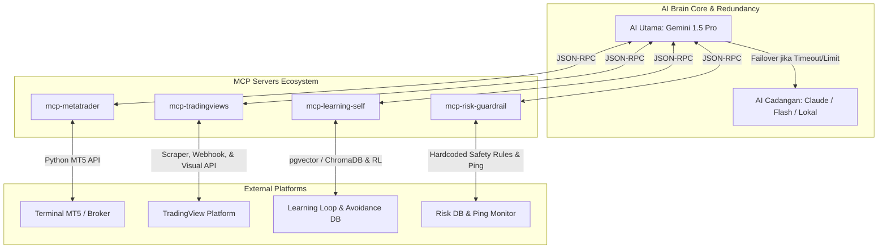
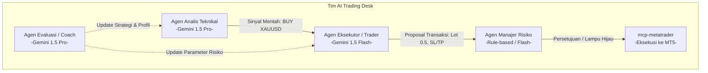
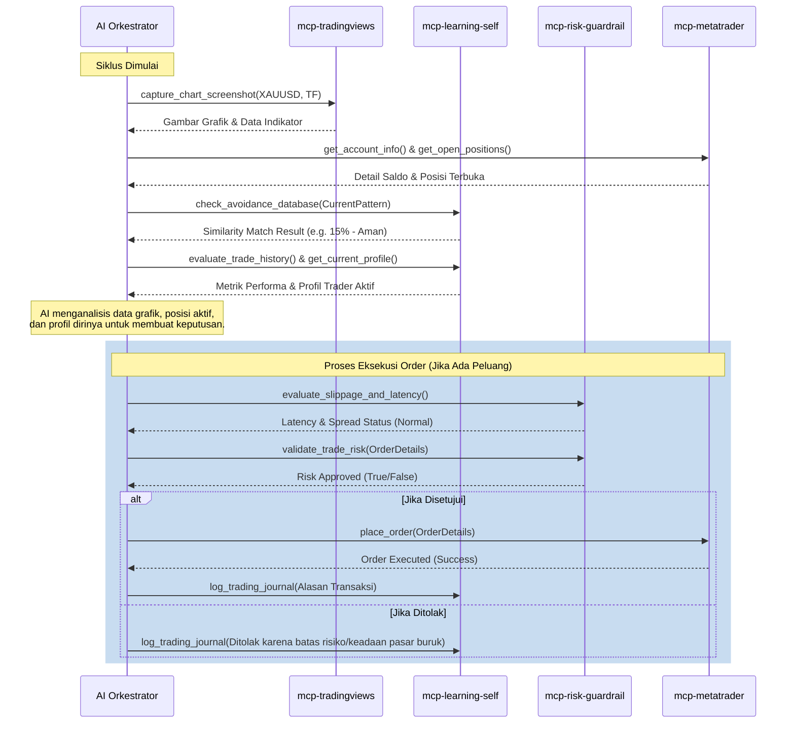

# Rencana Arsitektur Trading Otonom 100% Berbasis Model Context Protocol (MCP)

Sistem ini dirancang dengan pendekatan modular menggunakan **Model Context Protocol (MCP)**. Dibandingkan arsitektur monolitik tradisional, arsitektur berbasis MCP memungkinkan AI bertindak sebagai "Orkestrator" yang dapat secara dinamis memanggil alat (*tools*), membaca sumber data (*resources*), dan memperbarui pemahamannya sendiri melalui antarmuka protokol terstandarisasi.

> [!NOTE]
> **FOKUS IMLEMENTASI TAHAP AWAL:** Sistem ini akan dikonfigurasi dan diuji secara eksklusif menggunakan instrumen komoditas **XAUUSD (Emas / Gold)**. Hal ini dilakukan untuk mematangkan alur data, validasi model, dan manajemen risiko pada satu aset berlikuiditas & bervolatilitas tinggi sebelum melakukan ekspansi ke multi-aset.

---

## 1. Arsitektur Komponen Berbasis MCP

AI Utama (Orkestrator) akan berinteraksi secara dua arah dengan empat server MCP khusus yang berjalan di lingkungannya beserta mekanisme failover otomatis:

---

## 2. Spesifikasi Server MCP

### A. `mcp-metatrader` (Eksekusi, Manajemen Transaksi, & Portfolio Allocator)
Server ini bertindak sebagai jembatan langsung ke terminal **MetaTrader 5 (MT5)** menggunakan Python API bawaan MT5 untuk mengendalikan akun secara *real-time*.

*   **Fungsi Utama:** Membuka, memodifikasi, memantau, menutup transaksi, serta menghitung alokasi dana dinamis.
*   **Alat (*Tools*) yang Disediakan untuk AI:**
    1.  `get_account_info`: Mengambil saldo, ekuitas, margin bebas, dan leverage akun saat ini.
    2.  `get_open_positions`: Mendapatkan daftar transaksi yang sedang berjalan beserta status keuntungan/kerugian *floating*.
    3.  `place_order`: Mengirimkan perintah eksekusi pasar (BUY/SELL) dengan parameter ukuran lot, Stop Loss (SL), dan Take Profit (TP).
    4.  `modify_order`: Menggeser SL/TP untuk mengunci profit (*trailing stop*) secara dinamis.
    5.  `close_position`: Menutup transaksi tertentu secara instan.
    6.  `get_historical_ticks`: Menarik data tick historis untuk dianalisis oleh modul pemelajaran mandiri.
    7.  `get_terminal_status`: Memeriksa konektivitas ke terminal MT5 dan status server broker (ping, status pasar buka/tutup).
    8.  `optimize_portfolio_allocation` **[PREMIUM]**: Menggunakan algoritma **Kelly Criterion** dan **Modern Portfolio Theory (MPT)** untuk menghitung pembagian lot dinamis (untuk fase ekspansi multi-aset di masa depan).

---

### B. `mcp-tradingviews` (Analisis Pasar Visual & Teknikal) - *EXPANDED & POWERFUL*
Server ini tidak hanya membaca indikator dasar, melainkan dikembangkan menjadi stasiun analisis canggih yang memanfaatkan kemampuan penuh TradingView secara programatis, visual, dan statistik.

*   **Fungsi Utama:** Memberikan pemahaman visual mendalam, interaksi chart dua arah, eksekusi pengujian strategi (*backtest*), dan sistem alarm berbasis kejadian (*event-driven alerts*).
*   **Alat (*Tools*) yang Disediakan untuk AI:**
    1.  `get_tradingview_signals`: Mengambil ringkasan rekomendasi teknikal (Strong Buy, Buy, Sell, Strong Sell) dari TradingView untuk simbol XAUUSD.
    
    2.  `get_chart_indicators` **[EXPANDED]**: Mengambil data indikator yang diplot di chart TradingView secara jauh lebih mendalam:
        *   **Dynamic Custom Indicator Injection:** Memungkinkan AI menyuntikkan dan memplot kalkulasi indikator kustom langsung ke grafik.
        *   **Historical Indicator Time-Series:** Menarik riwayat deret waktu indikator XAUUSD untuk mendeteksi tren atau sebagai input model.
        *   **Multi-Timeframe Alignment:** Mengambil snapshot indikator XAUUSD dari beberapa timeframe secara simultan (M15, H1, H4, D1).
        *   **Automatic Divergence Engine:** Mendeteksi pola divergensi teknikal otomatis secara matematis pada XAUUSD.

    3.  `capture_chart_screenshot`: Mengambil tangkapan layar (*screenshot*) grafik XAUUSD di TradingView secara *headless* dan mengirimkannya ke AI untuk analisis multi-modal (Gemini 1.5 Pro).
    
    4.  `draw_annotations_on_chart` **[EXPANDED - CANDLESTICK & PATTERN DETECTION ENGINE]**: Menginstruksikan server untuk menggambar analisis teknikal secara visual pada chart XAUUSD sebelum mengambil screenshot:
        *   **Automated Candlestick Pattern Detector:** Menggunakan algoritma pengenalan pola untuk mendeteksi pola candlestick klasik secara *real-time* (*Hammer, Shooting Star, Engulfing, Morning/Evening Star, Doji, Pin Bar*). Server akan menggambar lingkaran berwarna kontras disertai label teks di atas candle yang terdeteksi sebelum screenshot diambil.
        *   **Automated Chart Pattern Overlay:** Mendeteksi dan menggambar pola grafik makro seperti *Head and Shoulders*, *Double Top/Bottom*, *Triangles*, serta *Channels* pada XAUUSD.
        *   **Smart Money Concept (SMC) & Liquidity Landmarks:** Mendeteksi dan menggambar area **Order Blocks (OB)**, **Fair Value Gaps (FVG)**, area likuiditas (*liquidity sweeps*), serta level harga tertinggi/terendah hari sebelumnya (PDH/PDL) secara visual pada chart XAUUSD.
        *   **Dynamic Drawing tools:** AI tetap memiliki kemampuan untuk menggambar garis tren manual, level support/resistance, atau kotak area Fibonacci kustom.

    5.  `run_pine_backtest`: Mengirimkan kode **Pine Script** kustom yang dibuat AI ke TradingView, menjalankan simulasi pengujian strategi historis pada bursa secara otomatis, dan menarik laporan performa lengkap untuk XAUUSD.
    6.  `manage_tv_alerts`: Membuat, memodifikasi, atau menghapus peringatan harga atau indikator di TradingView secara terprogram untuk XAUUSD.

---

### C. `mcp-learning-self` (Adaptasi & Peningkatan Diri Mandiri) - *EXPANDED & POWERFUL*
Server ini adalah "pusat pelatihan" di mana AI melacak performanya sendiri, mengidentifikasi kesalahan, dan menyesuaikan perilakunya agar menyerupai trader profesional secara dinamis.

*   **Fungsi Utama:** Menyimpan riwayat perdagangan, mengevaluasi kesalahan (*journaling*), mengoptimalkan parameter model, serta **menghindari pengulangan kesalahan pola loss masa lalu**.
*   **Alat (*Tools*) yang Disediakan untuk AI:**
    1.  `evaluate_trade_history`: Menghitung metrik performa secara mendalam (Win Rate, Profit Factor, Sharpe Ratio, Max Drawdown) dari riwayat transaksi riil XAUUSD.
    2.  `update_trader_profile`: Menyesuaikan tingkat keagresifan AI (misal: beralih dari profil "Agresif" ke "Konservatif" setelah mendeteksi kerugian beruntun).
    3.  `run_local_optimization`: Menjalankan pelatihan ulang mikro (*micro-training loop*) menggunakan algoritma Reinforcement Learning sederhana secara lokal untuk menyesuaikan bobot strategi terhadap data XAUUSD terbaru.
    4.  `log_trading_journal`: Menyimpan catatan evaluasi subjektif AI tentang mengapa suatu transaksi sukses atau gagal sebagai referensi memori jangka panjang (*vector database*).
    5.  `check_avoidance_database` **[PREMIUM]**: Menggunakan **Vector Database (seperti pgvector/ChromaDB)** untuk menyimpan keadaan pasar (screenshot chart, indikator, sentimen) setiap kali bot mengalami loss di XAUUSD. Sebelum entry posisi baru, AI melakukan pencarian kemiripan (*similarity search*). Jika kemiripan pola dengan kegagalan historis >85%, transaksi ditolak atau ukuran lot otomatis dikurangi demi keselamatan.

---

### D. `mcp-risk-guardrail` (Keamanan Modal Utama & Pelindung Slippage) - *EXPANDED & POWERFUL*
*   **Fungsi Utama:** Memastikan tidak ada order yang dikirim ke bursa sebelum lolos verifikasi parameter risiko keras (*hard-coded limits*) serta **mengamankan transaksi dari lonjakan spread dan latensi tinggi**.
*   **Alat (*Tools*) yang Disediakan untuk AI:**
    1.  `validate_trade_risk`: Memeriksa apakah lot size, jarak SL, dan total eksposur risiko dari usulan transaksi yang dibuat oleh AI melanggar batas aman.
    2.  `check_drawdown_limit`: Memantau jika batas kerugian harian terlampaui. Jika ya, server ini akan menolak semua fungsi `place_order` di `mcp-metatrader` dan mematikan sistem secara paksa (*emergency kill switch*).
    3.  `evaluate_slippage_and_latency` **[PREMIUM]**: Mengukur kecepatan koneksi (*round-trip time*) ke server broker dan lebar selisih harga jual-beli (*bid-ask spread*). Jika koneksi lambat atau spread terlalu lebar (biasanya terjadi saat rilis berita besar), sistem secara otomatis mengalihkan order pasar menjadi **Limit Order** atau menunda eksekusi beberapa detik agar tidak diisi pada harga buruk.

---

## 3. Arsitektur Multi-Agent Trading Desk

Sistem ini membagi otak AI utama menjadi empat agen terspesialisasi dengan tugas (*jobdesk*) masing-masing untuk meningkatkan akurasi dan meminimalkan eror logika:

### 1. Agen Analis Teknikal (*The Technical Analyst*)
*   **Akses Alat:** `mcp-tradingviews`
*   **Model:** **Gemini 1.5 Pro** (unggul dalam pemahaman grafis/multi-modal).

### 2. Agen Eksekutor / Trader (*The Portfolio Manager*)
*   **Akses Alat:** `mcp-metatrader`
*   **Model:** **Gemini 1.5 Flash** (sangat cepat untuk kalkulasi matematika dan penyusunan draf).

### 3. Agen Manajer Risiko (*The Risk Compliance Officer*)
*   **Akses Alat:** `mcp-risk-guardrail`
*   **Model:** Kombinasi kode deterministik dan AI ringan.

### 4. Agen Evaluator & Mentor (*The Quantitative Coach*)
*   **Akses Alat:** `mcp-learning-self`
*   **Model:** **Gemini 1.5 Pro** (kemampuan penalaran logis tingkat lanjut).

---

## 4. Sistem Redundansi AI & Mekanisme Failover (Multi-Model Redundancy)
> [!IMPORTANT]
> Sistem trading otonom 100% wajib memiliki jaring pengaman jika layanan API AI utama mengalami kegagalan, batasan kuota (*rate limits*), atau pemeliharaan dadakan saat pasar sedang aktif bergerak.

*   **Deteksi Kegagalan Respons:** AI Orkestrator utama akan diprogram untuk memantau waktu respons (timeout) API utama (Gemini 1.5 Pro). Jika respons memakan waktu lebih dari 5 detik atau mengembalikan kode kesalahan HTTP (seperti 429 atau 500), sistem secara otomatis memicu **Failover Routine**.
*   **Pemberlakuan AI Cadangan:** Alur kerja dialihkan seketika ke model sekunder yang dikonfigurasi (seperti Claude 3.5 Sonnet, Gemini 1.5 Flash, atau model open-source lokal ringan yang terpasang di server cloud Anda).
*   **Safe-Mode Execution:** Dalam kondisi failover, AI cadangan diprioritaskan hanya untuk mengelola posisi aktif (seperti menggeser SL ke titik impas atau melakukan penutupan parsial) dan meminimalkan pembukaan posisi baru sampai API utama pulih sepenuhnya.

---

## 5. Mekanisme Penanganan Eror & Pemantauan Kode (Error Monitoring & Code Health)
> [!IMPORTANT]
> Sistem trading otonom 100% wajib memiliki tingkat ketahanan tinggi terhadap kegagalan perangkat lunak, masalah jaringan, dan eror API dari pihak ketiga.

### A. Penanganan Eror Kode Broker & Koneksi (MT5 Error Codes)
Server `mcp-metatrader` akan dilengkapi dengan interpreter kode eror bawaan. Jika terjadi kegagalan transaksi, sistem akan merespons sesuai kategori eror berikut:
*   **Eror Jaringan / Timeout (Eror 10014, 10019, atau Koneksi Putus):** Sistem secara otomatis mengaktifkan mode *retry* dengan jeda waktu eksponensial (*exponential backoff*). Jika setelah 3 kali gagal tetap tidak terhubung, sistem akan mengaktifkan *Emergency Halt* dan membatalkan semua order tertunda (*pending orders*).
*   **Eror Likuiditas / Batas Dana (Eror 10018 - "Market Closed" atau Eror 10009 - "Invalid Volume"):** Sistem akan segera mematikan Agen Eksekutor untuk simbol tersebut dan mengirimkan alarm prioritas tinggi kepada pengembang.

### B. Heartbeat Check & Sistem Pengawas (Watchdog Service)
*   **Fungsi Ping Kontinyu:** Setiap 30 detik, modul pengawas akan mengirimkan perintah ping ke terminal MT5 dan bursa TradingView.
*   **Graceful Shutdown:** Jika salah satu server MCP tidak merespons dalam 3 siklus heartbeat berturut-turut, AI Orkestrator akan secara otomatis menarik diri dari pasar, menutup posisi yang rentan jika dikonfigurasi, dan menolak membuka transaksi baru demi mengamankan modal.

---

## 6. Alur Orkestrasi Sistem secara Real-Time

Siklus berjalan otonom diatur dalam urutan berikut setiap *interval* waktu (misal: setiap 15 menit atau setiap penutupan bar baru):

---

## 7. Rencana Kerja Pengerjaan (Action Plan) dengan Claude Code
> [!TIP]
> **Claude Code** akan bertindak asisten pemrograman utama yang bertanggung jawab menulis kode, menjalankan pengujian otomatis (*automated testing*), dan memantau tumpukan eror (*debugging*) di setiap tahapan.

### Tahap 1: Pembuatan Boilerplate & Kerangka Server MCP
*   **Eksekusi:** Claude Code membuat kerangka kerja dasar (*boilerplate*) server MCP menggunakan SDK Python/Node.js.
*   **Pengujian & Validasi Bug:** Claude menulis unit test untuk memastikan komunikasi protokol RPC (JSON-RPC) berjalan 100% lancar tanpa kegagalan transmisi.

### Tahap 2: Pembangunan `mcp-metatrader` & Uji Koneksi Terminal (Fokus: XAUUSD)
*   **Eksekusi:** Mengintegrasikan pustaka `MetaTrader5` Python ke dalam perkakas RPC serta menyusun kode untuk modul **Portfolio Allocator** (dibatasi khusus untuk XAUUSD terlebih dahulu).
*   **Pengujian & Validasi Bug:** Claude membuat skrip simulasi (*Dry-Run Test*) yang berpura-pura membuka dan menutup posisi di Akun Demo MT5 khusus pair XAUUSD. Claude memantau kode log untuk mematikan bot jika mendeteksi eror terminal atau masalah otorisasi akun.

### Tahap 3: Pembangunan `mcp-tradingviews` & Pemantauan Scraper (Fokus: XAUUSD)
*   **Eksekusi:** Membuat modul Puppeteer/Selenium untuk menangkap grafik XAUUSD, merancang mesin gambar visual pola candlestick, dan mengatur port penerima Webhook alarm untuk XAUUSD.
*   **Pengujian & Validasi Bug:** Menjalankan tes otomatis untuk memotret chart XAUUSD pada beberapa timeframe berbeda (M15, H1, H4). Claude memantau apakah ada eror render grafis, kegagalan pemuatan halaman (HTTP 5xx), atau kegagalan penempatan anotasi visual pada gambar.

### Tahap 4: Integrasi Database & Pengujian Pembelajaran `mcp-learning-self`
*   **Eksekusi:** Membuat database SQLite/Vector lokal untuk menyimpan log transaksi, evaluasi AI, dan membangun indeks **Vector Avoidance Engine** khusus untuk pola historis XAUUSD.
*   **Pengujian & Validasi Bug:** Menguji apakah pencarian kemiripan vektor (*similarity search*) berjalan di bawah 200 milidetik dan memverifikasi algoritma optimasi berjalan tanpa kebocoran memori (*memory leak*).

### Tahap 5: Simulasi Sistem Lengkap (*Integration & Sandbox Testing - Fokus XAUUSD*)
*   **Eksekusi:** Menghubungkan seluruh server MCP (MT5, TradingView, Risiko, Learning) ke AI Orkestrator dalam satu lingkungan lokal terisolasi (*sandbox*).
*   **Pengujian & Validasi Bug:** Menjalankan simulasi trading berkelanjutan selama 48 jam penuh menggunakan akun demo khusus untuk XAUUSD. Claude Code memantau log sistem secara *real-time* untuk mendeteksi apabila ada ketidaksesuaian alur eksekusi, kelambatan (*latency*), atau kegagalan komunikasi antar agen.

### Tahap 6: Pengujian Sistem Failover & Chaos Engineering
*   **Eksekusi:** Menguji skenario kegagalan paksa (*chaos test*) pada konektivitas API AI utama untuk memastikan rutinitas failover beralih dengan sukses ke model cadangan.
*   **Pengujian & Validasi Bug:** Mengukur waktu transisi failover untuk memastikan tidak ada posisi aktif yang dibiarkan tanpa manajemen resiko selama perpindahan sistem.

### Tahap 7: Sistem Telemetri & Alarm Eror Riil
*   **Eksekusi:** Mengintegrasikan modul pelaporan eror ke aplikasi pengirim pesan (seperti Telegram API atau Discord Webhook).
*   **Pengujian & Validasi Bug:** Sengaja menyuntikkan kegagalan buatan seperti memutus jaringan internet atau mematikan terminal MT5 secara paksa. Claude memverifikasi apakah bot berhasil mengirimkan pesan peringatan eror secara instan disertai cuplikan kode kerusakan (*stack trace*) ke Telegram/Discord Anda sebelum bot masuk ke mode aman (*graceful standby*).
