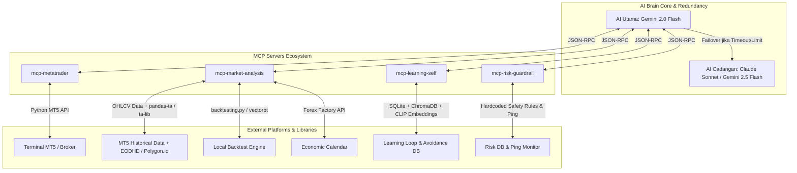
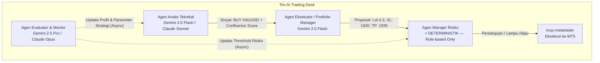
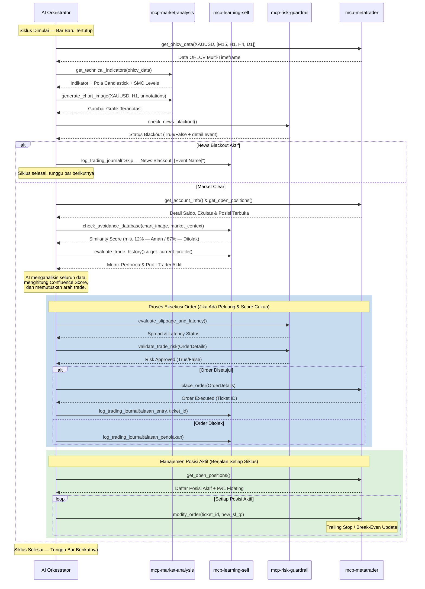

# Rencana Arsitektur Trading Otonom 100% Berbasis Model Context Protocol (MCP)
### Versi 2.0 — Revised & Production-Ready

Sistem ini dirancang dengan pendekatan modular menggunakan **Model Context Protocol (MCP)**. Dibandingkan arsitektur monolitik tradisional, arsitektur berbasis MCP memungkinkan AI bertindak sebagai "Orkestrator" yang dapat secara dinamis memanggil alat (*tools*), membaca sumber data (*resources*), dan memperbarui pemahamannya sendiri melalui antarmuka protokol terstandarisasi.

> [!NOTE]
> **FOKUS IMPLEMENTASI TAHAP AWAL:** Sistem ini akan dikonfigurasi dan diuji secara eksklusif menggunakan instrumen komoditas **XAUUSD (Emas / Gold)**. Hal ini dilakukan untuk mematangkan alur data, validasi model, dan manajemen risiko pada satu aset berlikuiditas & bervolatilitas tinggi sebelum melakukan ekspansi ke multi-aset.

> [!WARNING]
> **PERUBAHAN ARSITEKTUR MAYOR (v2.0):** Server `mcp-tradingview` (v1) yang berbasis scraper Puppeteer/Selenium telah digantikan sepenuhnya oleh `mcp-market-analysis` yang menggunakan pipeline data native. Scraping TradingView melanggar ToS platform tersebut dan tidak reliable untuk sistem produksi.

---

## 1. Arsitektur Komponen Berbasis MCP

AI Utama (Orkestrator) akan berinteraksi secara dua arah dengan empat server MCP khusus yang berjalan di lingkungannya beserta mekanisme failover otomatis:

---

## 2. Spesifikasi Server MCP

### A. `mcp-metatrader` (Eksekusi, Manajemen Transaksi, & Portfolio Allocator)

Server ini bertindak sebagai jembatan langsung ke terminal **MetaTrader 5 (MT5)** menggunakan Python API bawaan MT5 untuk mengendalikan akun secara *real-time*.

- **Fungsi Utama:** Membuka, memodifikasi, memantau, menutup transaksi, serta menghitung alokasi dana dinamis.
- **Alat (*Tools*) yang Disediakan untuk AI:**

  1. `get_account_info` — Mengambil saldo, ekuitas, margin bebas, dan leverage akun saat ini.
  2. `get_open_positions` — Mendapatkan daftar transaksi yang sedang berjalan beserta status keuntungan/kerugian *floating*.
  3. `place_order` — Mengirimkan perintah eksekusi pasar (BUY/SELL) dengan parameter ukuran lot, Stop Loss (SL), dan Take Profit (TP).
  4. `modify_order` — Menggeser SL/TP untuk mengunci profit (*trailing stop*) secara dinamis.
  5. `close_position` — Menutup transaksi tertentu secara instan.
  6. `get_ohlcv_data` — Menarik data OHLCV historis (candle) langsung dari MT5 untuk dianalisis oleh `mcp-market-analysis`. *(Menggantikan `get_historical_ticks` — tick data jarang dibutuhkan di level strategi; OHLCV lebih efisien.)*
  7. `get_terminal_status` — Memeriksa konektivitas ke terminal MT5 dan status server broker (ping, status pasar buka/tutup).
  8. `optimize_lot_size` **[KELLY CRITERION]** — Menghitung ukuran lot optimal menggunakan **Kelly Criterion** berdasarkan win rate dan risk/reward historis akun. *(Catatan: MPT dimasukkan ke roadmap fase multi-aset; tidak relevan untuk single-instrument XAUUSD.)*

---

### B. `mcp-market-analysis` (Analisis Teknikal & Backtesting Native) *(Baru — menggantikan `mcp-tradingview`)*

> [!IMPORTANT]
> Server ini sepenuhnya berbasis library Python lokal dan data dari broker/provider resmi. **Tidak ada scraping.** Seluruh analisis berjalan di-server tanpa ketergantungan pada pihak ketiga yang dapat berubah sewaktu-waktu.

- **Fungsi Utama:** Menghasilkan sinyal teknikal multi-timeframe, mendeteksi pola candlestick & chart, menggambar visualisasi grafik untuk analisis AI, serta menjalankan backtest strategi secara lokal.
- **Alat (*Tools*) yang Disediakan untuk AI:**

  1. `get_technical_indicators` **[MULTI-TIMEFRAME]** — Menghitung indikator teknikal menggunakan `pandas-ta` / `ta-lib` dari data OHLCV MT5 secara langsung:
      - **Multi-Timeframe Snapshot:** Mengambil nilai indikator XAUUSD dari M15, H1, H4, D1 sekaligus.
      - **Dynamic Indicator Selection:** AI dapat meminta kombinasi indikator yang relevan (EMA, RSI, MACD, ATR, Bollinger Bands, dll.) tanpa terbatas pada set statis.
      - **Automatic Divergence Detection:** Mendeteksi divergensi RSI/MACD secara matematis pada OHLCV data.

  2. `detect_candlestick_patterns` — Mendeteksi pola candlestick klasik (*Hammer, Shooting Star, Engulfing, Morning/Evening Star, Doji, Pin Bar*) menggunakan `ta-lib` pattern recognition secara akurat dan deterministik pada data XAUUSD.

  3. `detect_smc_levels` **[SMART MONEY CONCEPTS]** — Mendeteksi level-level penting secara algoritmik dari data OHLCV:
      - **Order Blocks (OB):** Area konsolidasi sebelum pergerakan impulse.
      - **Fair Value Gaps (FVG):** Gap antara shadow candle yang belum ter-fill.
      - **Previous Day High/Low (PDH/PDL):** Level referensi harian.
      - **Swing High/Low & Liquidity Sweeps:** Identifikasi titik likuiditas yang telah diambil pasar.

  4. `generate_chart_image` — Membuat grafik OHLCV XAUUSD dengan anotasi lengkap menggunakan `mplfinance` dan `matplotlib`, kemudian menyimpannya sebagai gambar untuk dikirim ke AI (analisis multi-modal). Sepenuhnya dikendalikan secara programatik, tanpa browser.

  5. `run_backtest` **[LOCAL ENGINE]** — Menjalankan backtest strategi secara lokal menggunakan `backtesting.py` atau `vectorbt` pada data historis XAUUSD dari broker, dan mengembalikan laporan performa lengkap (Win Rate, Profit Factor, Max Drawdown, Sharpe Ratio).

  6. `check_economic_calendar` **[NEWS FILTER — BARU]** — Mengambil jadwal rilis berita high-impact dari **Forex Factory API** atau **Investing.com scraper resmi**. Mengembalikan daftar event dalam ±60 menit ke depan. Digunakan oleh `mcp-risk-guardrail` untuk memblokir entry baru secara proaktif sebelum rilis berita besar (NFP, CPI, FOMC, dll.).

---

### C. `mcp-learning-self` (Adaptasi & Peningkatan Diri Mandiri)

Server ini adalah "pusat pelatihan" di mana AI melacak performanya sendiri, mengidentifikasi kesalahan, dan menyesuaikan perilakunya secara dinamis.

- **Fungsi Utama:** Menyimpan riwayat perdagangan, mengevaluasi kesalahan (*journaling*), mengoptimalkan parameter profil risiko, serta menghindari pengulangan kesalahan pola loss masa lalu.
- **Alat (*Tools*) yang Disediakan untuk AI:**

  1. `evaluate_trade_history` — Menghitung metrik performa secara mendalam (Win Rate, Profit Factor, Sharpe Ratio, Max Drawdown) dari riwayat transaksi riil XAUUSD.

  2. `update_trader_profile` — Menyesuaikan tingkat keagresifan AI (misal: beralih dari profil "Agresif" ke "Konservatif" setelah mendeteksi kerugian beruntun). Parameter yang dapat disesuaikan: risk per trade %, max daily loss threshold, minimum confluence score untuk entry.

  3. `run_parameter_optimization` *(v2 — scope dipersempit dari RL penuh)* — Menjalankan optimasi parameter **profil risiko dan filter sinyal** menggunakan grid search atau Bayesian optimization pada data historis yang sudah ada. **Bukan micro-training RL pada data live.** *(Catatan: RL penuh pada live market sangat berisiko overfitting ke regime terkini; optimasi dilakukan offline secara terjadwal, misal: mingguan.)*

  4. `log_trading_journal` — Menyimpan catatan evaluasi subjektif AI tentang mengapa suatu transaksi sukses atau gagal sebagai referensi memori jangka panjang di SQLite + vector database.

  5. `check_avoidance_database` **[VECTOR SIMILARITY ENGINE]** — Menggunakan **ChromaDB** dengan embedding berbasis **CLIP** (untuk gambar chart) atau **text-embedding** (untuk deskripsi kondisi pasar) untuk menyimpan kondisi pasar saat terjadi loss. Sebelum entry posisi baru:
      - AI mengirimkan gambar chart terkini + deskripsi kondisi ke tool ini.
      - Tool melakukan pencarian kemiripan (*similarity search*) terhadap database pola loss historis.
      - Jika kemiripan >80% ditemukan, transaksi ditolak otomatis atau ukuran lot dikurangi 50%.
      - **Target Latency:** <500ms (menggunakan CLIP embedding yang di-cache; bukan inference model besar per-request).

---

### D. `mcp-risk-guardrail` (Keamanan Modal Utama — Deterministik & Non-LLM)

> [!IMPORTANT]
> **Seluruh logika di server ini bersifat deterministik (rule-based).** Tidak ada LLM yang terlibat dalam proses validasi risiko. Keputusan risiko harus matematis, konsisten, dan latensi rendah (<50ms).

- **Fungsi Utama:** Memastikan tidak ada order yang dikirim ke bursa sebelum lolos verifikasi parameter risiko keras (*hard-coded limits*), mengamankan transaksi dari lonjakan spread dan latensi tinggi, serta memblokir trading proaktif saat berita high-impact.
- **Alat (*Tools*) yang Disediakan untuk AI:**

  1. `validate_trade_risk` — Memeriksa secara matematis apakah lot size, jarak SL, dan total eksposur risiko melanggar batas aman. Menghitung % risiko terhadap ekuitas dan menolak jika melebihi threshold (misal: >1.5% per trade).

  2. `check_drawdown_limit` — Memantau jika batas kerugian harian terlampaui. Jika ya, server ini akan menolak semua fungsi `place_order` di `mcp-metatrader` dan mematikan sistem secara paksa (*emergency kill switch*).

  3. `evaluate_slippage_and_latency` — Mengukur round-trip time ke server broker dan bid-ask spread. Jika spread melebihi threshold (misal: >3 pips untuk XAUUSD), sistem **menunda atau membatalkan eksekusi** — bukan mengubah ke limit order secara otomatis. *(Catatan: konversi otomatis ke limit order berisiko miss trade valid; lebih aman skip dan tunggu kondisi normal.)*

  4. `check_news_blackout` **[BARU]** — Memanggil data dari `mcp-market-analysis::check_economic_calendar`. Jika ada event high-impact dalam ±30 menit, tool ini mengembalikan status `BLACKOUT: TRUE` yang memblokir seluruh entry baru secara proaktif. Ini adalah lapisan proteksi **sebelum** spread melebar.

  5. `get_risk_status_summary` — Mengembalikan ringkasan status risiko saat ini dalam satu panggilan: drawdown harian, posisi terbuka, risk exposure total, dan status blackout berita.

---

## 3. Arsitektur Multi-Agent Trading Desk

Sistem ini membagi otak AI menjadi empat agen terspesialisasi. **Agen Manajer Risiko bersifat deterministik** untuk memastikan latensi rendah di jalur kritis eksekusi order.

> [!NOTE]
> Agen Evaluator berjalan **asinkron** (tidak dalam loop eksekusi utama) untuk menghindari penambahan latency pada siklus trading. Evaluasi dilakukan setelah setiap trade tertutup atau secara terjadwal.

### 1. Agen Analis Teknikal (*The Technical Analyst*)
- **Akses Alat:** `mcp-market-analysis`
- **Model:** **Gemini 2.0 Flash** (cepat, mendukung multi-modal untuk analisis chart image)
- **Output:** Sinyal arah (BUY/SELL/NO TRADE) + Confluence Score (0–100) + level entry, SL, TP yang disarankan.

### 2. Agen Eksekutor / Portfolio Manager (*The Trader*)
- **Akses Alat:** `mcp-metatrader`, `mcp-risk-guardrail`
- **Model:** **Gemini 2.0 Flash** (latensi rendah untuk kalkulasi dan penyusunan order)
- **Tanggung Jawab:** Menerima sinyal, menghitung lot size (menggunakan `optimize_lot_size`), menyusun proposal order, dan submit ke pipeline risiko.

### 3. Agen Manajer Risiko (*The Risk Compliance Officer*)
- **Akses Alat:** `mcp-risk-guardrail`
- **Model:** ⚡ **Pure Rule-Based / Deterministik — Tanpa LLM**
- **Alasan:** Keputusan risiko harus konsisten, cepat (<50ms), dan tidak bergantung pada inference model yang bisa timeout.

### 4. Agen Evaluator & Mentor (*The Quantitative Coach*)
- **Akses Alat:** `mcp-learning-self`
- **Model:** **Gemini 2.5 Pro** atau **Claude Opus** (kemampuan penalaran mendalam)
- **Jadwal:** Berjalan asinkron setelah setiap trade tertutup, atau terjadwal setiap akhir sesi trading.

---

## 4. Sistem Redundansi AI & Mekanisme Failover (Multi-Model Redundancy)

> [!IMPORTANT]
> Sistem trading otonom 100% wajib memiliki jaring pengaman jika layanan API AI utama mengalami kegagalan, batasan kuota (*rate limits*), atau pemeliharaan dadakan saat pasar sedang aktif bergerak.

- **Deteksi Kegagalan Respons:** AI Orkestrator utama memantau timeout API. Jika respons memakan waktu lebih dari **12 detik** (dinaikan dari 5 detik untuk menghindari false failover saat memproses chart image) atau mengembalikan kode kesalahan HTTP (429 atau 500), sistem memicu **Failover Routine** dengan **Circuit Breaker Pattern** (tidak langsung retry terus-menerus).
- **Pemberlakuan AI Cadangan:** Alur kerja dialihkan ke model sekunder (Claude Sonnet, Gemini 2.5 Flash, atau model lokal ringan).
- **Safe-Mode Execution:** Dalam kondisi failover, AI cadangan diprioritaskan **hanya untuk manajemen posisi aktif** (menggeser SL ke titik impas atau melakukan penutupan parsial). Pembukaan posisi baru diblokir sampai API utama pulih.

---

## 5. Mekanisme Penanganan Error & Pemantauan Kode

> [!IMPORTANT]
> Sistem trading otonom 100% wajib memiliki tingkat ketahanan tinggi terhadap kegagalan perangkat lunak, masalah jaringan, dan error API dari pihak ketiga.

### A. Penanganan Error Broker & Koneksi (MT5 Error Codes)

Server `mcp-metatrader` dilengkapi dengan interpreter kode error bawaan. Setiap error ditangani sesuai kategorinya:

| Kode Error | Arti Sebenarnya | Respons Sistem |
|---|---|---|
| **10006** | `TRADE_RETCODE_TIMEOUT` — Request timeout ke broker | Retry dengan exponential backoff (max 3x). Jika gagal semua → Emergency Halt |
| **10014** | `TRADE_RETCODE_INVALID_STOPS` — SL/TP tidak valid | Batalkan order, log error, kirim alert ke developer. **Jangan retry** |
| **10018** | `TRADE_RETCODE_MARKET_CLOSED` — Market tutup | Matikan Agen Eksekutor, set jadwal reaktivasi saat market buka |
| **10019** | `TRADE_RETCODE_NO_MONEY` — Saldo tidak cukup | Emergency Halt seluruh sistem, kirim alert prioritas tinggi |
| **10009** | `TRADE_RETCODE_INVALID_VOLUME` — Lot size tidak valid | Batalkan order, minta Agen Eksekutor recalculate lot size |
| **TCP Disconnect** | Koneksi ke terminal MT5 terputus | Aktivasi Watchdog Service, coba reconnect. Jika gagal 3x → Safe Mode |

### B. Heartbeat Check & Sistem Pengawas (Watchdog Service)

- **Fungsi Ping Kontinyu:** Setiap 30 detik, modul pengawas mengirimkan perintah ping ke terminal MT5 dan memverifikasi koneksi data market.
- **Graceful Shutdown:** Jika server MCP tidak merespons dalam 3 siklus heartbeat berturut-turut, AI Orkestrator otomatis menarik diri dari pasar, menutup posisi yang rentan (jika dikonfigurasi), dan menolak membuka transaksi baru demi mengamankan modal.

---

## 6. Alur Orkestrasi Sistem secara Real-Time

Siklus berjalan otonom diatur dalam urutan berikut setiap interval waktu (setiap penutupan bar baru, misal: setiap 15 menit):

---

## 7. Rencana Kerja Pengerjaan (Action Plan) dengan Claude Code

> [!TIP]
> **Claude Code** akan bertindak sebagai asisten pemrograman utama yang bertanggung jawab menulis kode, menjalankan pengujian otomatis (*automated testing*), dan memantau tumpukan error (*debugging*) di setiap tahapan.

### Tahap 1: Pembuatan Boilerplate & Kerangka Server MCP
- **Eksekusi:** Claude Code membuat kerangka kerja dasar (*boilerplate*) untuk semua 4 server MCP menggunakan FastMCP (Python). Setiap server berjalan di port terpisah dan dapat diuji secara independen.
- **Pengujian & Validasi:** Claude menulis unit test untuk memastikan komunikasi JSON-RPC berjalan 100% lancar. Setiap tool harus mengembalikan schema response yang terdefinisi dengan baik, bukan free-text.

### Tahap 2: Pembangunan `mcp-metatrader` & Uji Koneksi Terminal (Fokus: XAUUSD)
- **Eksekusi:** Mengintegrasikan pustaka `MetaTrader5` Python. Mengimplementasikan Kelly Criterion untuk `optimize_lot_size`. Membuat tabel error code handler yang lengkap sesuai Section 5A.
- **Pengujian & Validasi:** Claude membuat skrip *Dry-Run Test* yang mensimulasikan buka/tutup posisi di Akun Demo MT5 khusus XAUUSD. Claude memantau semua error code yang dikembalikan broker dan memverifikasi setiap respons ditangani sesuai tabel di Section 5A.

### Tahap 3: Pembangunan `mcp-market-analysis` & Validasi Sinyal (Fokus: XAUUSD)
- **Eksekusi:** Menginstall dan mengkonfigurasi `pandas-ta`, `ta-lib`, `mplfinance`, `vectorbt`. Membangun modul SMC detection (OB, FVG, PDH/PDL). Mengintegrasikan Forex Factory API untuk economic calendar.
- **Pengujian & Validasi:** Menjalankan backtest menggunakan data historis XAUUSD 2 tahun terakhir. Claude memverifikasi konsistensi sinyal antar timeframe dan akurasi deteksi pola candlestick dibandingkan library referensi.

### Tahap 4: Integrasi Database & Pengujian `mcp-learning-self`
- **Eksekusi:** Membuat database SQLite untuk jurnal trading dan ChromaDB untuk avoidance engine. Mengimplementasikan CLIP embedding pipeline untuk vectorisasi gambar chart.
- **Pengujian & Validasi:** Mengisi database dengan 50+ skenario loss historis sintetis, lalu menguji apakah similarity search mengembalikan hasil yang relevan dalam <500ms. Memverifikasi tidak ada memory leak pada proses embedding.

### Tahap 5: Pembangunan `mcp-risk-guardrail` & Stress Test (Deterministik)
- **Eksekusi:** Mengimplementasikan seluruh logika sebagai pure Python functions (tanpa LLM calls). Mengintegrasikan `check_news_blackout` dengan data dari `mcp-market-analysis`.
- **Pengujian & Validasi:** Menulis 100+ unit test yang mencakup edge case: lot size 0, SL terlalu dekat, drawdown sudah di batas, spread ekstrim, dan semua kombinasi blackout. Target: 100% test coverage di modul ini.

### Tahap 6: Simulasi Sistem Lengkap (*Integration & Sandbox Testing — Fokus XAUUSD*)
- **Eksekusi:** Menghubungkan seluruh 4 server MCP ke AI Orkestrator dalam satu lingkungan lokal terisolasi (*sandbox*) dengan Akun Demo MT5.
- **Pengujian & Validasi:** Menjalankan simulasi trading berkelanjutan selama **72 jam penuh** pada Akun Demo XAUUSD. Claude Code memantau log sistem secara *real-time*, mengukur latency setiap langkah dalam sequence diagram Section 6, dan mencatat deviasi dari perilaku yang diharapkan.

### Tahap 7: Pengujian Failover & Chaos Engineering
- **Eksekusi:** Menguji skenario kegagalan paksa pada API AI utama, koneksi internet, dan terminal MT5.
- **Pengujian & Validasi:** Mengukur waktu transisi failover — target <15 detik. Memverifikasi tidak ada posisi aktif yang dibiarkan tanpa manajemen risiko selama perpindahan sistem. Menguji circuit breaker agar tidak masuk infinite retry loop.

### Tahap 8: Sistem Telemetri & Alarm Error (Production Monitoring)
- **Eksekusi:** Mengintegrasikan modul pelaporan error ke **Telegram Bot API** (primer) dan **Discord Webhook** (sekunder). Setiap alert menyertakan: jenis error, stack trace, kondisi pasar saat itu, dan status posisi aktif.
- **Pengujian & Validasi:** Menyuntikkan kegagalan buatan (putus internet, MT5 mati paksa, API 429). Memverifikasi alert terkirim dalam <10 detik disertai informasi yang cukup untuk diagnosis cepat. Setelah alert terkirim, sistem harus masuk *graceful standby* — bukan crash.

---

## Changelog v1.0 → v2.0

| # | Komponen | Perubahan |
|---|---|---|
| 1 | `mcp-tradingview` | **Dihapus** — digantikan `mcp-market-analysis` (native, tanpa scraping) |
| 2 | Error code MT5 | **Dikoreksi** — 10014 & 10019 bukan network error; tabel lengkap ditambahkan |
| 3 | Agen Manajer Risiko | **Dijadikan deterministik** — tidak menggunakan LLM untuk keputusan risiko |
| 4 | Model AI | **Diperbarui** ke Gemini 2.0/2.5 & Claude Sonnet (Gemini 1.5 deprecated) |
| 5 | Failover timeout | **Dinaikan** 5s → 12s untuk mencegah false failover saat proses chart image |
| 6 | Economic calendar | **Ditambahkan** `check_news_blackout` sebagai lapisan proteksi proaktif |
| 7 | RL live training | **Dipersempit** menjadi offline parameter optimization (bukan RL pada live data) |
| 8 | MPT | **Dikeluarkan** dari fase awal — hanya Kelly Criterion untuk single-asset XAUUSD |
| 9 | Agen Evaluator | **Dijadikan asinkron** — tidak dalam loop eksekusi utama |
| 10 | Sequence diagram | **Ditambahkan** manajemen posisi aktif (trailing stop) di setiap siklus |
| 11 | CLIP embedding | **Dispesifikasi** sebagai embedding engine untuk avoidance database |
